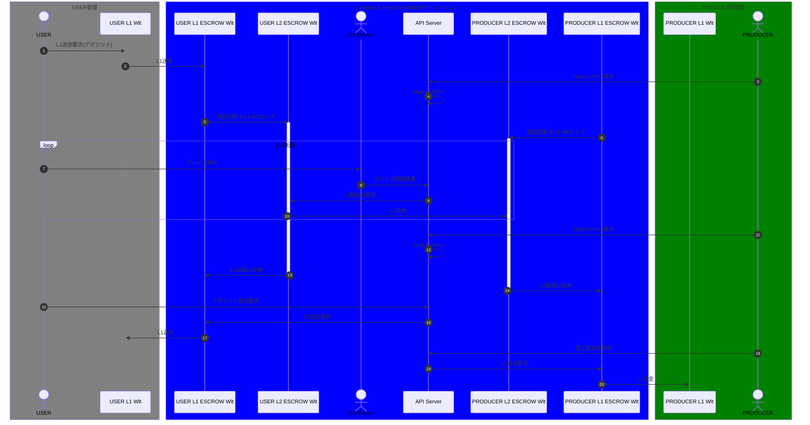

# API基本シーケンス

```mermaid
sequenceDiagram
    autonumber

    box gray USER管理
    actor U as USER
    participant UL1 as USER L1 Wlt
    end

    box blue Cardano & Hydra ESCROWソリューション
    participant UL1E as USER L1 ESCROW Wlt
    participant UL2E as USER L2 ESCROW Wlt
    actor D as IoT Device
    participant S as API Server
    participant PL2E as PRODUCER L2 ESCROW Wlt
    participant PL1E as PRODUCER L1 ESCROW Wlt
    end

    box green PRODUCER管理
    participant PL1 as PRODUCER L1 Wlt
    actor P as PRODUCER
    end

    %% USER 正常系シーケンス
    U ->> UL1: L1送金要求(デポジット)
    UL1 ->> UL1E: L1送金
    P ->> S: Hydra OPEN要求
    S ->> S: Hydra OPEN
    UL1E ->>UL2E: 残高同期 & L1 Wltロック
    activate UL2E
    PL1E ->>PL2E: 残高同期 & L1 Wltロック
    activate PL2E

    loop L2決済
    U ->> D: デバイス操作
    D ->> S: デバイス制御結果
    S ->> UL2E: L2間送金要求
    UL2E ->> PL2E: L2送金
    end
    
    P ->> S: Hydra Close要求
    S ->> S: Hydra Close
    UL2E ->> UL1E: L2結果L1反映
    deactivate UL2E

    PL2E ->> PL1E: L2結果L1反映
    deactivate PL2E
    U ->> S: デポジット返還要求
    S ->> UL1E: L1送金要求
    UL1E ->> UL1: L1送金
    P ->> S: 売上高送金要求
    S ->> PL1E: L1送金要求
    PL1E ->> PL1: L1送金

```
