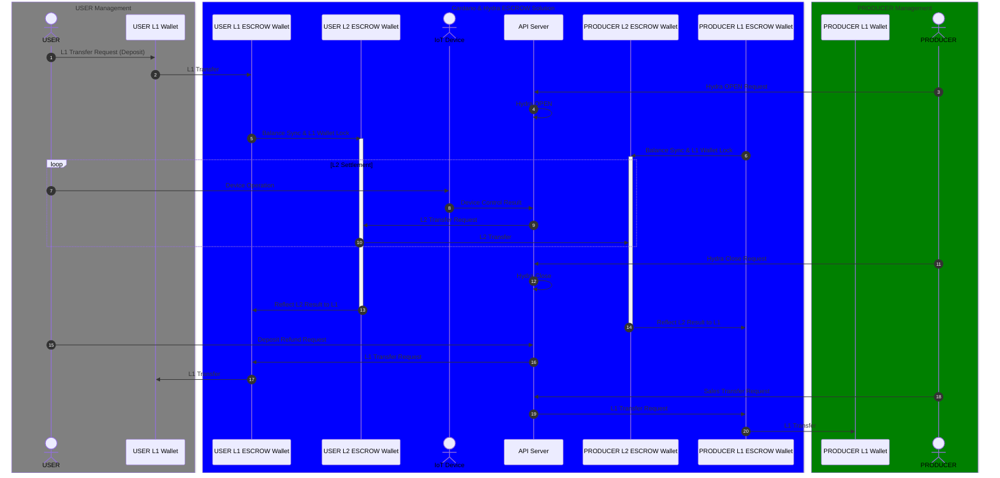

# API Normal Sequence

```mermaid
sequenceDiagram
    autonumber

    box gray USER Management
    actor U as USER
    participant UL1 as USER L1 Wallet
    end

    box blue Cardano & Hydra ESCROW Solution
    participant UL1E as USER L1 ESCROW Wallet
    participant UL2E as USER L2 ESCROW Wallet
    actor D as IoT Device
    participant S as API Server
    participant PL2E as PRODUCER L2 ESCROW Wallet
    participant PL1E as PRODUCER L1 ESCROW Wallet
    end

    box green PRODUCER Management
    participant PL1 as PRODUCER L1 Wallet
    actor P as PRODUCER
    end

    %% USER Normal Sequence
    U ->> UL1: L1 Transfer Request (Deposit)
    UL1 ->> UL1E: L1 Transfer
    P ->> S: Hydra OPEN Request
    S ->> S: Hydra OPEN
    UL1E ->> UL2E: Balance Sync & L1 Wallet Lock
    activate UL2E
    PL1E ->> PL2E: Balance Sync & L1 Wallet Lock
    activate PL2E

    loop L2 Settlement
    U ->> D: Device Operation
    D ->> S: Device Control Result
    S ->> UL2E: L2 Transfer Request
    UL2E ->> PL2E: L2 Transfer
    end
    
    P ->> S: Hydra Close Request
    S ->> S: Hydra Close
    UL2E ->> UL1E: Reflect L2 Result to L1
    deactivate UL2E

    PL2E ->> PL1E: Reflect L2 Result to L1
    deactivate PL2E
    U ->> S: Deposit Refund Request
    S ->> UL1E: L1 Transfer Request
    UL1E ->> UL1: L1 Transfer
    P ->> S: Sales Transfer Request
    S ->> PL1E: L1 Transfer Request
    PL1E ->> PL1: L1 Transfer

```
